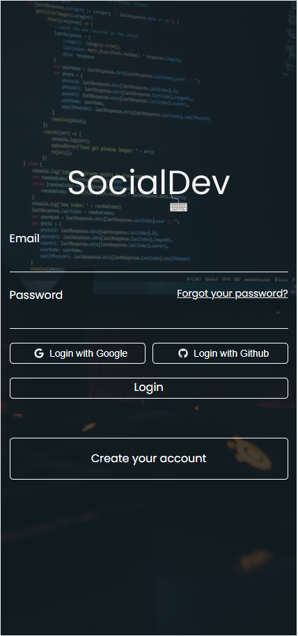
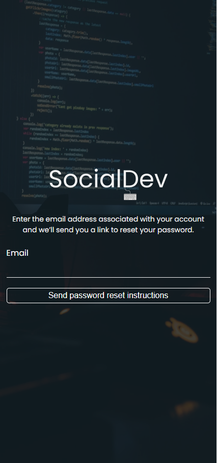
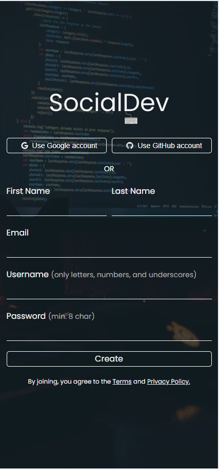

# Desafio Técnico - SPA Silva e Pelaquim Associados.

# Desafio Prático

### 💻 Sobre o projeto

Desenvolver o Frontend de uma REDE SOCIAL FAKE para desenvolvedores

### Screenshots

- Mobile
<details>

<h1 align="center">
   <p>Login</p>
    
    <p>Forget Passoword</p>
    
    <p>Create Account</p>
    

</h1>
</details>

- Web
<details>

</details>

#### 🧭 Rodando a aplicação web (Frontend)

```bash

# Clone este repositório
$ git clone git@github.com:andersona16/desafio-SPA.git

# Acesse a pasta do projeto no seu terminal/cmd
$ cd desafio-spa

# Caso queira acessar a aplicação pelo o Visual Studio Code.
$ code .

# Instale as dependências
$ yarn

# Execute a aplicação em modo de desenvolvimento
$ yarn start

# A aplicação será aberta na porta:3000 - acesse http://localhost:3000

```

### 🛠 Tecnologias

As seguintes ferramentas foram usadas na construção do projeto:

- [ReactJS](https://pt-br.reactjs.org/)
- [TypeScript](https://www.typescriptlang.org/)
- [Axios](https://axios-http.com/docs/intro)
- [Styled-Components](https://styled-components.com/)
- [React-icons](https://react-icons.github.io/react-icons/)

## 🦸 Autor

[;&link=https://www.linkedin.com/in/andersonaraujjo/>)](https://www.linkedin.com/in/andersonaraujjo/)
[;&link=mailto:andersonaraujoc1@gmail.com>)](mailto:andersonaraujoc1@gmail.com)
